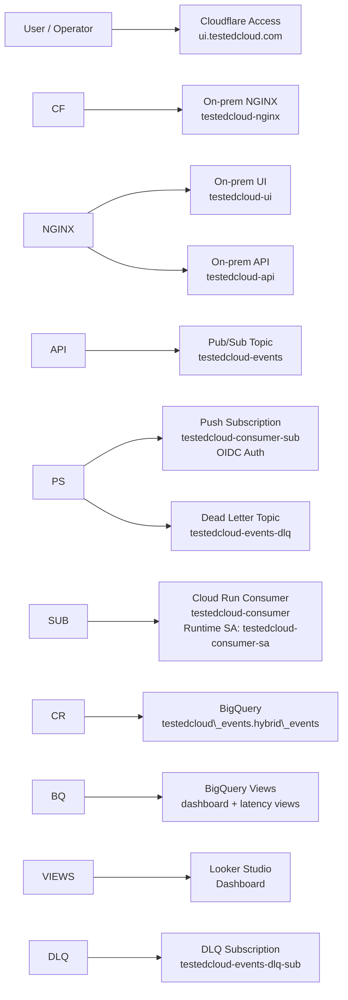
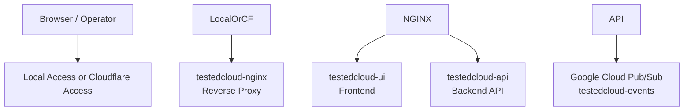
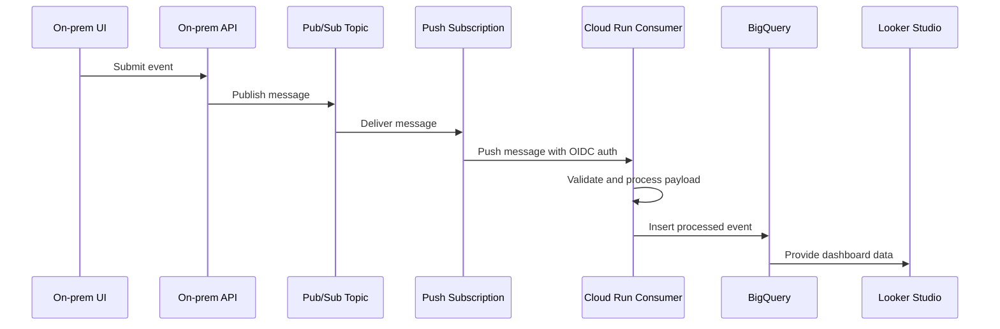
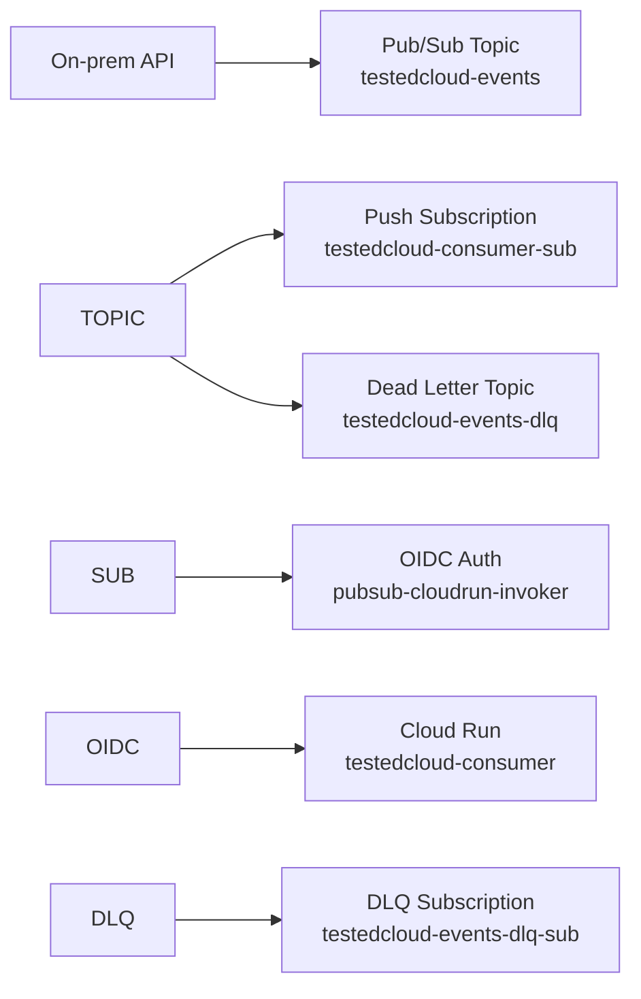
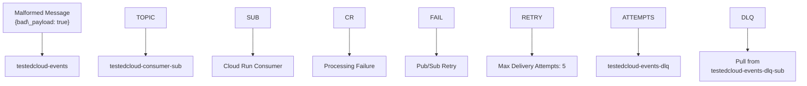
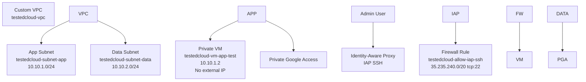
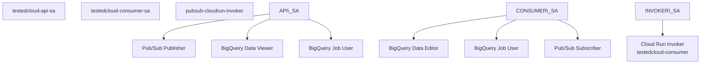
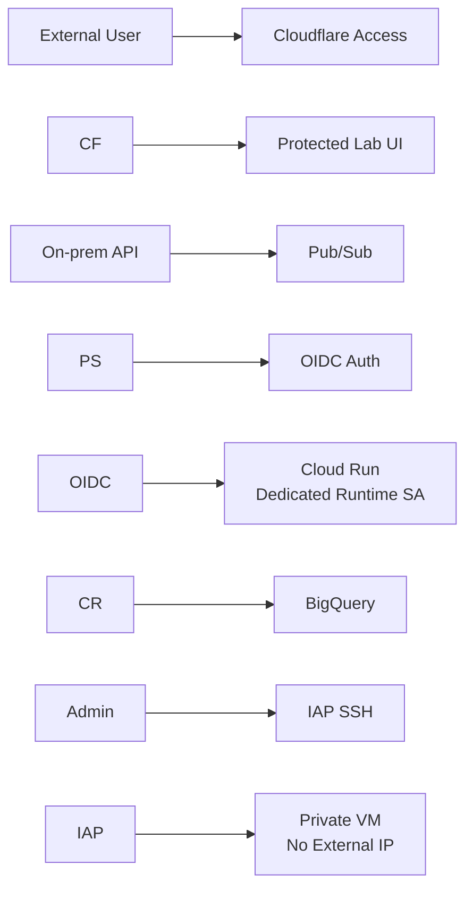
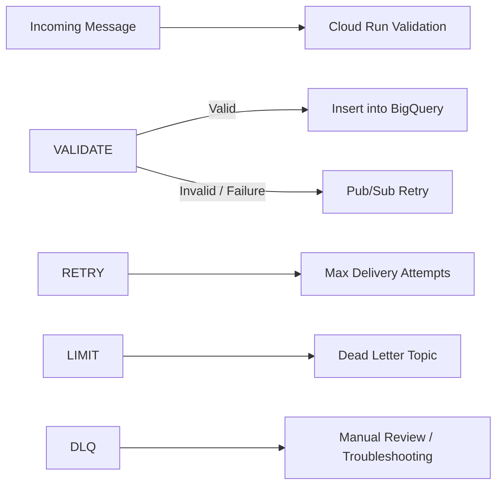

# TestedCloud Hybrid Architecture

## 1\. Purpose

This document describes the current hybrid architecture of TestedCloud, including the on-prem Docker environment, protected external access, Google Cloud event ingestion pipeline, analytics layer, private networking, dead-letter queue handling, and IAM model.

The purpose of this document is to provide a visual and technical explanation of how the lab connects on-prem infrastructure with Google Cloud services in a secure, observable, and cost-conscious way.

This architecture supports the main TestedCloud portfolio narrative:

> TestedCloud demonstrates how on-prem workloads can securely integrate with cloud-native services for event ingestion, serverless processing, analytics, observability, IAM hardening, and private networking.

## 2\. Architecture Summary

The current TestedCloud Core Platform follows this flow:

```text
User / Operator
    |
    v
Cloudflare Access
    |
    v
On-prem NGINX / UI / API
    |
    v
Google Cloud Pub/Sub
    |
    v
Cloud Run Consumer
    |
    v
BigQuery
    |
    v
BigQuery Views
    |
    v
Looker Studio Dashboard
```

The platform also includes:

* A custom Google Cloud VPC
* App and data subnets
* Private Google Access
* A private VM without external IP
* IAP SSH access
* Dedicated service accounts
* Pub/Sub OIDC authentication to Cloud Run
* A Pub/Sub dead-letter queue for failed messages

## 3\. High-Level Hybrid Architecture



## 4\. On-Prem Architecture

The on-prem portion of TestedCloud runs on an Intel NUC using Ubuntu Server and Docker Compose.

Current on-prem environment:

|Component|Value|
|-|-|
|Hostname|`ubuserver`|
|Hardware|`Intel NUC7i3BNH`|
|OS|`Ubuntu 24.04.4 LTS`|
|Project path|`/home/dario/testedcloud-lab`|
|Local lab port|`8082`|
|Local UI|`http://localhost:8082/`|
|Protected external UI|`https://ui.testedcloud.com`|

Docker Compose services:

|Service|Purpose|
|-|-|
|`testedcloud-ui`|Frontend application|
|`testedcloud-api`|Local API used to publish events|
|`testedcloud-nginx`|Reverse proxy for the local app stack|

### On-Prem Flow



## 5\. Google Cloud Event Pipeline

The Google Cloud event pipeline receives events from the on-prem API and processes them with serverless cloud services.

Core Google Cloud project information:

|Item|Value|
|-|-|
|Project ID|`majestic-layout-255620`|
|Project number|`644725546932`|
|Primary region|`us-central1`|

Core services:

* Pub/Sub
* Cloud Run
* BigQuery
* Looker Studio
* IAM
* VPC
* IAP

### Event Processing Flow



## 6\. Pub/Sub Design

Pub/Sub is used as the ingestion layer between the on-prem environment and the cloud processing layer.

Topics:

|Topic|Purpose|
|-|-|
|`testedcloud-events`|Main event ingestion topic|
|`testedcloud-events-dlq`|Dead-letter topic for failed messages|

Subscriptions:

|Subscription|Purpose|
|-|-|
|`testedcloud-consumer-sub`|Push subscription to Cloud Run|
|`testedcloud-events-dlq-sub`|Pull subscription to inspect DLQ messages|

The main subscription pushes messages to Cloud Run using OIDC authentication through a dedicated service account.



## 7\. Dead-Letter Queue Flow

The dead-letter queue validates the reliability behavior of the pipeline when invalid messages cannot be processed successfully.

A malformed payload was published:

```json
{"bad\_payload": true}
```

Expected behavior:

1. Pub/Sub delivers the malformed message to Cloud Run.
2. Cloud Run fails to process or rejects the payload.
3. Pub/Sub retries delivery.
4. After the configured maximum delivery attempts, the message is routed to the DLQ.
5. The DLQ subscription can be inspected to analyze failed messages.

Validated result:

* The bad payload reached the DLQ after five attempts.



## 8\. Cloud Run Design

Cloud Run hosts the serverless event consumer:

|Item|Value|
|-|-|
|Service|`testedcloud-consumer`|
|Region|`us-central1`|
|URL|`https://testedcloud-consumer-644725546932.us-central1.run.app`|
|Runtime identity|`testedcloud-consumer-sa`|

Cloud Run responsibilities:

* Receive Pub/Sub push messages
* Validate incoming payloads
* Process valid event data
* Insert structured records into BigQuery
* Return successful responses for valid messages
* Allow failed messages to be retried and eventually routed to DLQ

Security improvement completed:

* Cloud Run was migrated away from the default Compute Engine service account.
* It now uses the dedicated runtime service account `testedcloud-consumer-sa`.

## 9\. BigQuery Analytics Layer

BigQuery is the analytical storage layer for processed events.

Dataset:

```text
testedcloud\_events
```

Main table:

```text
testedcloud\_events.hybrid\_events
```

Schema:

|Field|Type|Purpose|
|-|-|-|
|`event\_id`|STRING|Unique event identifier|
|`received\_at`|TIMESTAMP|Time when the event was received or created|
|`source`|STRING|Source system|
|`event\_type`|STRING|Event category|
|`message`|STRING|Event message|
|`origin`|STRING|Origin environment or workload|
|`processed\_at`|TIMESTAMP|Time when Cloud Run processed the event|
|`user\_email`|STRING|User identity when available|

Dashboard and latency views:

* `v\_dashboard\_events`
* `v\_dashboard\_events\_v2`
* `v\_latency\_metrics`
* `v\_latency\_metrics\_v2`

## 10\. Dashboard Layer

Looker Studio is used as the visualization layer.

The dashboard is intended to demonstrate:

* Total event count
* Events by source
* Events by origin
* Events by event type
* Event volume over time
* Processing latency
* p50, p95, and p99 latency metrics
* Pipeline behavior after IAM hardening
* Pipeline behavior after DLQ validation

Current observed metrics:

|Metric|Value|
|-|-|
|Total events|72+|
|Web UI events|63|
|On-prem NUC events|3|
|Private GCP VM events|2|
|p50 latency|0 seconds|
|p95 latency|5 seconds|
|p99 latency|5 seconds|

## 11\. Private Cloud Network

The cloud networking layer uses a custom VPC with separate subnets for application and data tiers.

Custom VPC:

```text
testedcloud-vpc
```

Subnets:

|Subnet|CIDR|Region|Purpose|
|-|-|-|-|
|`testedcloud-subnet-app`|`10.10.1.0/24`|`us-central1`|Application tier|
|`testedcloud-subnet-data`|`10.10.2.0/24`|`us-central1`|Data tier|

Private Google Access:

* Enabled on both subnets

Private VM:

|Item|Value|
|-|-|
|VM name|`testedcloud-vm-app-test`|
|Zone|`us-central1-a`|
|Machine type|`e2-micro`|
|Internal IP|`10.10.1.2`|
|External IP|None|
|Access method|IAP SSH|

Firewall rules:

|Rule|Purpose|
|-|-|
|`testedcloud-allow-iap-ssh`|Allows IAP SSH from `35.235.240.0/20` to TCP/22|
|`testedcloud-allow-internal`|Allows internal communication inside the VPC|



## 12\. IAM and Service Account Model

The platform uses dedicated service accounts instead of relying on the default Compute Engine service account.

Current service accounts:

|Service Account|Purpose|
|-|-|
|`testedcloud-api-sa@majestic-layout-255620.iam.gserviceaccount.com`|API/on-prem publishing identity|
|`testedcloud-consumer-sa@majestic-layout-255620.iam.gserviceaccount.com`|Cloud Run runtime identity|
|`pubsub-cloudrun-invoker@majestic-layout-255620.iam.gserviceaccount.com`|Pub/Sub OIDC identity to invoke Cloud Run|



## 13\. IAM Hardening Completed

Important hardening actions completed:

* Cloud Run `testedcloud-consumer` was migrated from the default Compute Engine service account to `testedcloud-consumer-sa`.
* Legacy Cloud Run service `project1` was deleted.
* `roles/editor` was removed from the default Compute Engine service account.
* `roles/bigquery.dataEditor` was removed from the default Compute Engine service account.
* Validation showed no remaining IAM bindings for `644725546932-compute@developer.gserviceaccount.com`.
* The event pipeline continued working after IAM hardening.

Security value:

* Reduced blast radius
* Improved least-privilege posture
* Removed unnecessary dependency on default service account
* Improved alignment with production-style identity design

## 14\. Security Architecture

Implemented security controls:

|Control|Description|
|-|-|
|Cloudflare Access|Protects external access to `ui.testedcloud.com`|
|No direct public IP exposure|Router port forwarding to port `8082` was removed|
|Dedicated Cloud Run service account|Cloud Run uses `testedcloud-consumer-sa`|
|Pub/Sub OIDC auth|Pub/Sub uses `pubsub-cloudrun-invoker` to invoke Cloud Run|
|Private VM|VM has no external IP|
|IAP SSH|Administrative access goes through IAP|
|Least-privilege IAM|Default compute service account no longer has broad roles|
|DLQ|Failed messages are isolated for inspection|
|Custom VPC|Cloud resources are placed in a controlled network|
|Private Google Access|Private subnets can reach Google APIs without external IPs|



## 15\. Validated Traffic Flows

The following flows have been validated:

|Flow|Status|
|-|-|
|Web UI event to Pub/Sub|Validated|
|Pub/Sub push to Cloud Run|Validated|
|Cloud Run insert to BigQuery|Validated|
|BigQuery views for dashboard|Validated|
|Manual on-prem NUC event to BigQuery|Validated|
|Private VM event to BigQuery|Validated|
|Bad payload to DLQ|Validated|
|IAP SSH to private VM|Validated|
|Cloudflare Access protection|Validated|
|Direct public IP exposure removed|Validated|
|IAM hardening without breaking pipeline|Validated|

## 16\. Failure Handling Flow

The current architecture handles malformed or failed messages using Pub/Sub retry behavior and a DLQ.



## 17\. DNS and Access Model

The target DNS and access model separates public portfolio content from protected lab access.

|Domain|Purpose|Access Model|
|-|-|-|
|`testedcloud.com`|Public portfolio landing page|Public|
|`ui.testedcloud.com`|Protected lab UI|Cloudflare Access|
|`api.testedcloud.com`|Optional future protected API endpoint|Protected / restricted|

Current important decision:

* The public portfolio should not expose the operational lab directly.
* The protected lab UI remains behind Cloudflare Access.
* The root domain should be used for portfolio storytelling and documentation.

## 18\. Cost-Conscious Architecture

The current design is intentionally lightweight and cost-conscious.

Cost-conscious decisions:

* Cloud Run is used for serverless processing and can scale to zero.
* Pub/Sub is suitable for low-volume event ingestion.
* BigQuery is used for analytical storage and dashboarding.
* A small `e2-micro` VM is used for private networking tests.
* The lab uses an existing on-prem Intel NUC.
* The design is limited mainly to `us-central1`.
* Cloudflare Access is used for protected access instead of exposing services directly.

Cost risks to monitor:

* BigQuery query costs from frequent dashboard refreshes
* Unexpected Cloud Run invocations
* Long-running VMs
* Future Vertex AI experiments
* Excessive log ingestion or retention

Recommended improvement:

* Configure Google Cloud budget alerts at 50%, 80%, and 100% of the monthly lab budget.

## 19\. Portfolio Value

This architecture demonstrates practical knowledge of:

* Hybrid cloud integration
* Event-driven architecture
* Serverless processing
* Pub/Sub push subscriptions
* Cloud Run runtime identity
* BigQuery analytics
* Looker Studio dashboards
* IAM least privilege
* Custom VPC design
* Private subnets
* Private Google Access
* IAP SSH
* Cloudflare Access
* Dead-letter queues
* Operational troubleshooting
* Cost-conscious cloud design

## 20\. Interview Explanation

A concise way to explain this architecture in an interview:

> TestedCloud is a hybrid cloud lab I built to demonstrate how on-prem workloads can securely integrate with Google Cloud. The on-prem layer runs on an Ubuntu-based Intel NUC using Docker Compose. Events generated from the local UI/API are published to Pub/Sub, processed by a Cloud Run consumer, stored in BigQuery, and visualized through Looker Studio. I also implemented a custom VPC with private subnets, IAP SSH access to a private VM, Cloudflare Access for the external UI, Pub/Sub OIDC authentication to Cloud Run, a dead-letter queue, and IAM hardening using dedicated service accounts instead of the default compute service account.

## 21\. Current Limitations

Current limitations:

* `/api/health` endpoint is not implemented yet.
* API key is currently hardcoded in the frontend.
* Monitoring alerts are not fully configured.
* Budget alerts are not configured yet.
* The public landing page is not complete yet.
* Architecture diagrams should eventually be exported as PNG/SVG for the public portfolio.
* Secrets management should be improved before broader exposure.
* Industrial telemetry modules are planned but not implemented yet.
* BGP/hybrid connectivity lab is planned but not implemented yet.

## 22\. Next Improvements

Recommended next improvements:

1. Add `/api/health`.
2. Add Cloud Run monitoring alerts.
3. Add Pub/Sub subscription backlog alerts.
4. Add DLQ message count alerts.
5. Add budget alerts.
6. Improve Looker Studio dashboard presentation.
7. Export architecture diagrams as images.
8. Build public landing page at `testedcloud.com`.
9. Keep protected UI under `ui.testedcloud.com`.
10. Start TestedChat MVP after the Core Platform documentation is complete.

## 23\. Final Positioning

This architecture demonstrates the ability to bridge industrial infrastructure and modern Google Cloud architecture.

It connects on-prem operations, secure networking, event-driven design, serverless processing, analytics, IAM hardening, and cloud portfolio storytelling into a single practical lab.

