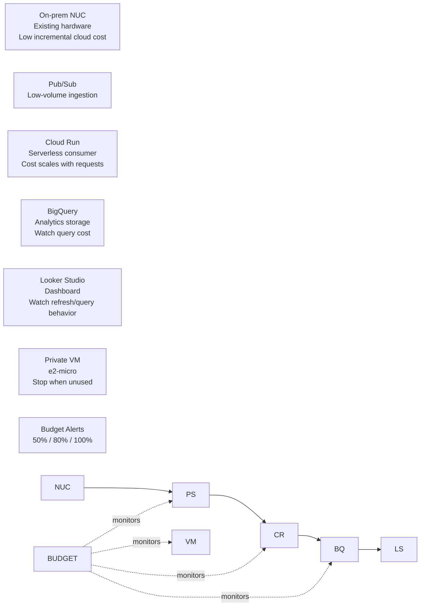

# TestedCloud Cost Considerations

## 1\. Purpose

This document describes the cost considerations for the TestedCloud Core Platform.

The purpose is to show that the lab was not only designed for functionality and security, but also with cost awareness. Cost-conscious architecture is important for any cloud environment, especially for demos, prototypes, labs, and customer-facing proofs of concept.

This document supports the TestedCloud portfolio narrative by demonstrating practical understanding of Google Cloud cost drivers, low-cost design patterns, budget control, and cost-risk mitigation.

## 2\. Cost-Conscious Design Summary

TestedCloud was intentionally designed as a lightweight hybrid cloud lab.

Current cost-conscious design choices:

* Existing on-prem hardware is used for the local environment.
* Docker Compose runs the on-prem UI/API/NGINX stack without additional cloud compute.
* Cloud Run is used for serverless processing.
* Pub/Sub is used for low-volume event ingestion.
* BigQuery is used for analytics and dashboarding.
* A small `e2-micro` VM is used for private networking tests.
* The cloud deployment is concentrated in `us-central1`.
* The private VM is used only for lab validation and should not run unnecessarily.
* Cloudflare Access protects the lab UI without exposing the on-prem service directly.
* Future high-cost services such as Vertex AI should be isolated and budget-controlled.

## 3\. Current Architecture Cost Areas

The current TestedCloud architecture has the following cost areas:

|Area|Services / Resources|Cost Sensitivity|
|-|-|-|
|On-prem compute|Intel NUC, Docker Compose|Low incremental cloud cost|
|Event ingestion|Pub/Sub topic and subscriptions|Low at lab scale|
|Serverless processing|Cloud Run consumer|Low if traffic remains minimal|
|Analytics storage|BigQuery dataset and table|Low at small data volume|
|Analytics queries|BigQuery views and dashboard queries|Can grow with dashboard refreshes|
|Dashboarding|Looker Studio|Low for current use|
|Private networking|VPC, subnets, firewall rules|Usually low/no direct cost|
|Private VM|Compute Engine `e2-micro`|Cost depends on runtime|
|Logs and monitoring|Cloud Logging / Cloud Monitoring|Can grow with log volume|
|Future AI/ML|Vertex AI, BigQuery ML, advanced analytics|Potentially higher cost|

## 4\. Current Low-Cost Architecture Pattern

Current flow:

```text
On-prem NUC / Docker
    |
    v
Pub/Sub
    |
    v
Cloud Run
    |
    v
BigQuery
    |
    v
Looker Studio
```

Why this is cost-conscious:

* The on-prem NUC handles the UI/API layer.
* Pub/Sub decouples the producer from the consumer without requiring dedicated servers.
* Cloud Run can scale based on requests and does not require a permanently running VM for the consumer.
* BigQuery is appropriate for analytical queries and small-volume event storage.
* Looker Studio provides dashboarding without building a custom dashboard backend.
* The private VM is small and should be used mainly for validation.

## 5\. Cost Considerations by Component

### 5.1 On-Prem NUC

The on-prem environment runs on an existing Intel NUC.

Current on-prem components:

* `testedcloud-ui`
* `testedcloud-api`
* `testedcloud-nginx`

Cost profile:

* No additional Google Cloud compute cost for running the UI/API locally.
* Uses existing home lab hardware.
* Uses local power and internet.
* Good for demonstrating hybrid cloud and edge-to-cloud patterns.

Cost benefit:

```text
The on-prem NUC reduces cloud compute cost while also demonstrating a realistic hybrid architecture.
```

### 5.2 Cloud Run

Cloud Run hosts:

```text
testedcloud-consumer
```

Cost considerations:

* Cloud Run is cost-efficient for low-volume event processing.
* It avoids running a permanent VM for the consumer workload.
* Cost may increase with request volume, CPU/memory allocation, or high concurrency needs.
* Logs generated by Cloud Run can contribute to Cloud Logging costs if volume grows.

Cost controls:

* Keep traffic low during lab/demo use.
* Avoid excessive retries from failing messages.
* Monitor Cloud Run request count and error rate.
* Use minimal CPU/memory configuration appropriate for the workload.
* Avoid excessive structured logging volume.

Portfolio value:

```text
Cloud Run demonstrates a serverless processing pattern that is appropriate for event-driven workloads and cost-conscious prototypes.
```

### 5.3 Pub/Sub

Pub/Sub resources:

* `testedcloud-events`
* `testedcloud-events-dlq`
* `testedcloud-consumer-sub`
* `testedcloud-events-dlq-sub`

Cost considerations:

* Pub/Sub is suitable for low-volume event ingestion.
* Cost is generally low at lab scale.
* Excessive retries, high message volume, or large messages can increase cost.
* DLQ behavior helps isolate bad messages and prevents endless unobserved failure loops.

Cost controls:

* Keep event payloads small.
* Monitor undelivered messages.
* Monitor DLQ message count.
* Avoid infinite retry patterns.
* Use DLQ to isolate malformed payloads.

Portfolio value:

```text
Pub/Sub demonstrates asynchronous decoupling between on-prem workloads and cloud-native processing.
```

### 5.4 BigQuery

BigQuery resources:

```text
testedcloud\_events.hybrid\_events
```

Views:

* `v\_dashboard\_events`
* `v\_dashboard\_events\_v2`
* `v\_latency\_metrics`
* `v\_latency\_metrics\_v2`

Cost considerations:

* Storage cost should remain low because the dataset is small.
* Query cost can increase if dashboard refreshes query large tables frequently.
* Views should be designed to avoid scanning unnecessary data.
* Long-term growth may require partitioning or clustering.

Cost controls:

* Limit dashboard refresh frequency.
* Use views that query only required fields.
* Consider partitioning by `processed\_at` or `received\_at` if the table grows.
* Consider clustering by `source`, `event\_type`, or `origin` if query patterns justify it.
* Use `LIMIT` during testing.
* Avoid repeatedly querying full tables unnecessarily.

Potential future optimization:

```sql
PARTITION BY DATE(processed\_at)
CLUSTER BY source, event\_type, origin
```

Portfolio value:

```text
BigQuery demonstrates analytics architecture, but cost awareness requires controlling query patterns and dashboard behavior.
```

### 5.5 Looker Studio

Looker Studio is used for dashboarding.

Cost considerations:

* Looker Studio itself may not be the main cost driver in this lab.
* The underlying BigQuery queries triggered by dashboard refreshes can drive query cost.
* Frequent refreshes or inefficient views can increase BigQuery usage.

Cost controls:

* Use efficient BigQuery views.
* Avoid unnecessary dashboard widgets.
* Limit date ranges.
* Avoid auto-refresh intervals that are too aggressive.
* Use aggregated views when possible.

Portfolio value:

```text
Looker Studio demonstrates business-facing analytics and dashboard communication.
```

### 5.6 Compute Engine Private VM

Private VM:

```text
testedcloud-vm-app-test
```

Current configuration:

* Zone: `us-central1-a`
* Machine type: `e2-micro`
* Internal IP: `10.10.1.2`
* No external IP
* Access through IAP SSH

Cost considerations:

* Even small VMs can generate cost while running.
* Persistent disks can continue to cost even if the VM is stopped.
* External IP cost is avoided because the VM has no external IP.
* The VM should be stopped when not actively needed for testing.

Cost controls:

* Stop the VM when not in use.
* Use minimal disk size.
* Avoid attaching unnecessary resources.
* Use labels to identify lab resources.
* Consider automation to stop lab VMs outside test windows.

Portfolio value:

```text
The private VM demonstrates secure private administration and VPC design, while remaining lightweight.
```

### 5.7 Cloud Logging and Monitoring

Logging and monitoring are important for operational visibility.

Cost considerations:

* Excessive application logs can increase logging costs.
* High-cardinality logs can be noisy and expensive.
* Retention policies should be reviewed if log volume grows.
* Monitoring alerts are valuable, but should be meaningful to avoid alert fatigue.

Cost controls:

* Use structured logs, but avoid logging entire payloads unnecessarily.
* Avoid logging secrets or sensitive data.
* Log important events such as `PIPELINE\_EVENT\_PROCESSED`.
* Add alerts for critical conditions only.
* Review log volume periodically.

Recommended monitoring areas:

* Cloud Run 5xx errors
* Cloud Run request count
* Pub/Sub subscription backlog
* DLQ message count
* BigQuery query usage
* Budget thresholds

### 5.8 Future Vertex AI / Advanced Analytics

Future roadmap includes Vertex AI and advanced analytics.

Cost considerations:

* Vertex AI can become significantly more expensive than the current lab services.
* Model training, prediction endpoints, notebooks, and GPUs can create unexpected cost if not controlled.
* Experiments should be isolated and budget-limited.

Cost controls:

* Use small datasets first.
* Avoid always-on prediction endpoints unless required.
* Shut down notebooks and workbench instances when not used.
* Use budget alerts before enabling AI experiments.
* Document every AI resource created.
* Prefer BigQuery ML or lightweight analytics first if appropriate.

Portfolio value:

```text
Future AI work should demonstrate practical judgment about when to use cloud AI versus simpler analytics.
```

## 6\. Budget Alert Strategy

Budget alerts should be configured before adding more services.

Recommended budget thresholds:

|Threshold|Purpose|
|-|-|
|50%|Early awareness|
|80%|Action threshold|
|100%|Stop and review|
|120%|Escalation threshold if configured|

Recommended approach:

```text
Small monthly lab budget
    |
    v
Alerts at 50%, 80%, 100%
    |
    v
Review active resources
    |
    v
Stop or delete unnecessary services
```

Recommended budget name:

```text
TestedCloud Lab Budget
```

Recommended notification target:

* Personal email
* Optional Pub/Sub notification topic in the future

## 7\. Suggested Budget Alert Documentation

Once budget alerts are configured, capture evidence:

```bash
gcloud billing budgets list \\
  --billing-account=BILLING\_ACCOUNT\_ID \\
  > docs/evidence/budget-alerts-config.txt
```

If using console screenshots, store a sanitized screenshot or describe the configuration in:

```text
docs/evidence/budget-alerts-config.txt
```

Do not commit billing account IDs publicly if you prefer to keep them private.

## 8\. Recommended Labels

Use labels to identify lab resources.

Recommended labels:

|Label|Value|
|-|-|
|`project`|`testedcloud`|
|`environment`|`lab`|
|`owner`|`dario`|
|`purpose`|`portfolio`|
|`cost-center`|`personal-lab`|

Example label strategy:

```text
project=testedcloud
environment=lab
purpose=portfolio
```

Benefits:

* Easier cost filtering
* Easier resource inventory
* Easier cleanup
* Better portfolio documentation
* Better production-style hygiene

## 9\. Resource Cleanup Strategy

A lab environment should have a cleanup strategy.

Recommended cleanup checks:

* Stop private VMs when not needed.
* Delete unused Cloud Run services.
* Delete old container images if storage grows.
* Review Pub/Sub topics/subscriptions.
* Review BigQuery tables and old test data.
* Review Cloud Logging volume.
* Review unused service accounts.
* Review firewall rules.
* Review DNS records.
* Review Cloudflare tunnels/access apps.

Existing cleanup already completed:

* Legacy Cloud Run service `project1` was deleted.
* Broad default Compute Engine service account permissions were removed.
* Public router port forwarding was removed.

## 10\. Cost Risk Register

|Risk|Likelihood|Impact|Mitigation|
|-|-|-|-|
|VM left running unnecessarily|Medium|Low/Medium|Stop VM when not used|
|BigQuery dashboard queries grow|Medium|Medium|Use efficient views and date filters|
|Cloud Run logs become noisy|Medium|Low/Medium|Reduce unnecessary logs|
|Pub/Sub retry loop from bad payloads|Low/Medium|Low|DLQ and alerts|
|Vertex AI experiments generate cost|Future risk|High|Budget alerts and isolated tests|
|Forgotten resources after experiments|Medium|Medium|Labels and cleanup checklist|
|Public exposure causing unwanted traffic|Low|Medium|Cloudflare Access and no port forwarding|

## 11\. Suggested Monthly Review Checklist

Monthly lab cost review:

```text
\[ ] Review current billing dashboard
\[ ] Check active Compute Engine instances
\[ ] Check Cloud Run request volume
\[ ] Check BigQuery query volume
\[ ] Check Pub/Sub message volume
\[ ] Check Cloud Logging volume
\[ ] Check DLQ messages
\[ ] Review budget alerts
\[ ] Stop or delete unused resources
\[ ] Update documentation if architecture changed
```

## 12\. Cost-Aware Architecture Diagram



## 13\. Current Cost Posture

Current cost posture:

```text
Lightweight lab architecture
```

Reasons:

* Event volume is low.
* Cloud Run is used for request-based processing.
* Pub/Sub is used at lab scale.
* BigQuery data volume is small.
* Private VM is small.
* No expensive AI/ML services are currently active.
* On-prem NUC handles the local application layer.

Main current risk:

```text
Forgetting active resources or creating future high-cost services without budget controls.
```

## 14\. Recommended Next Actions

Recommended next actions:

1. Configure budget alerts.
2. Capture budget alert evidence.
3. Add resource labels.
4. Stop the private VM when not in active use.
5. Add monitoring alerts for DLQ and Cloud Run failures.
6. Review BigQuery dashboard refresh behavior.
7. Add cost section to public portfolio landing page.
8. Create a simple monthly cleanup checklist.
9. Avoid Vertex AI experiments until budget alerts are configured.
10. Document estimated monthly cost once billing data is available.

## 15\. Interview Explanation

A concise way to explain cost considerations in an interview:

> I designed TestedCloud to be cost-conscious from the beginning. The on-prem NUC runs the local UI/API stack, while Google Cloud is used for managed services such as Pub/Sub, Cloud Run, BigQuery, and Looker Studio. Cloud Run avoids a permanently running consumer VM, Pub/Sub supports low-volume decoupled ingestion, and BigQuery provides analytics while requiring query cost awareness. I also documented cost risks such as BigQuery dashboard refreshes, long-running VMs, log volume, and future Vertex AI experiments, and planned budget alerts at 50%, 80%, and 100%.

A more technical version:

> The cost model separates fixed local infrastructure from variable cloud services. The main cost drivers are Cloud Run invocations, Pub/Sub message volume, BigQuery storage/query usage, logging volume, and any running Compute Engine instances. The design is intentionally lightweight, but I still documented controls such as budget alerts, VM shutdown, BigQuery query optimization, resource labeling, and cleanup reviews.

## 16\. Customer Engineer Relevance

This cost analysis is relevant to Customer Engineer and Cloud Architect roles because it demonstrates the ability to:

* Think beyond technical functionality
* Discuss cost drivers clearly
* Choose managed services appropriately
* Explain serverless cost trade-offs
* Identify future cost risks
* Recommend budget alerts and governance
* Connect architecture decisions to customer business outcomes
* Balance reliability, security, and cost

## 17\. Final Positioning

The TestedCloud cost model demonstrates a practical approach to cost-conscious hybrid cloud architecture.

The lab uses managed Google Cloud services where they add value, keeps local workloads on existing on-prem infrastructure where appropriate, and documents cost risks before expanding into more expensive services such as Vertex AI.

This strengthens the portfolio by showing that TestedCloud is not only functional and secure, but also designed with operational and financial awareness.

