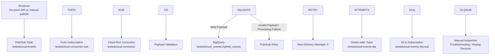

# TestedCloud DLQ Validation

## 1\. Purpose

This document describes the dead-letter queue validation performed in the TestedCloud Core Platform.

The goal of this validation was to confirm that the event ingestion pipeline can handle malformed or failed messages using Pub/Sub retry behavior and a dead-letter queue.

This is important because a production-style event-driven architecture should not only handle successful messages. It should also provide a controlled way to isolate, inspect, and troubleshoot messages that cannot be processed successfully.

## 2\. Architecture Context

TestedCloud uses Pub/Sub as the ingestion layer between the on-prem API and the Cloud Run consumer.

Current event flow:

```text
On-prem UI/API
    |
    v
Pub/Sub Topic: testedcloud-events
    |
    v
Push Subscription: testedcloud-consumer-sub
    |
    v
Cloud Run Consumer: testedcloud-consumer
    |
    v
BigQuery: testedcloud\_events.hybrid\_events
```

Failure handling flow:

```text
Malformed or failed message
    |
    v
Pub/Sub retry behavior
    |
    v
Maximum delivery attempts reached
    |
    v
Dead-letter topic: testedcloud-events-dlq
    |
    v
DLQ subscription: testedcloud-events-dlq-sub
```

## 3\. Pub/Sub Resources

Main topic:

```text
testedcloud-events
```

Dead-letter topic:

```text
testedcloud-events-dlq
```

Main push subscription:

```text
testedcloud-consumer-sub
```

Dead-letter subscription:

```text
testedcloud-events-dlq-sub
```

Cloud Run consumer:

```text
testedcloud-consumer
```

Cloud Run URL:

```text
https://testedcloud-consumer-644725546932.us-central1.run.app/
```

## 4\. DLQ Design

The main Pub/Sub subscription is configured with a dead-letter policy.

Expected behavior:

1. Pub/Sub receives a message on `testedcloud-events`.
2. Pub/Sub pushes the message to Cloud Run through `testedcloud-consumer-sub`.
3. Cloud Run validates the message.
4. If the message is valid, Cloud Run processes it and writes it to BigQuery.
5. If the message is invalid or cannot be processed, the delivery fails.
6. Pub/Sub retries the message.
7. After the configured maximum delivery attempts, Pub/Sub forwards the message to `testedcloud-events-dlq`.
8. The failed message can be pulled from `testedcloud-events-dlq-sub` for review.

Configured maximum delivery attempts:

```text
5
```

## 5\. DLQ Flow Diagram



## 6\. Test Objective

The objective of the test was to intentionally publish a malformed payload and confirm that:

* Cloud Run did not process it as a valid event.
* Pub/Sub retried delivery.
* The message eventually reached the DLQ.
* The failed message was visible from the DLQ subscription.
* The main pipeline remained functional for valid messages.

## 7\. Test Payload

The malformed payload used for validation was:

```json
{"bad\_payload": true}
```

This payload was intentionally missing the expected fields used by the normal event processing path.

Normal event records are expected to contain fields such as:

* `event\_id`
* `received\_at`
* `source`
* `event\_type`
* `message`
* `origin`
* `processed\_at`
* `user\_email`

The malformed payload was designed to trigger validation or processing failure.

## 8\. Test Command

The malformed payload was published using:

```bash
gcloud pubsub topics publish testedcloud-events \\
  --message='{"bad\_payload": true}'
```

Expected output format:

```text
messageIds:
- '<message-id>'
```

The exact message ID can be captured as evidence if needed.

## 9\. Subscription Configuration Validation

The main subscription can be inspected with:

```bash
gcloud pubsub subscriptions describe testedcloud-consumer-sub
```

Important fields to confirm:

```text
deadLetterPolicy:
  deadLetterTopic: projects/majestic-layout-255620/topics/testedcloud-events-dlq
  maxDeliveryAttempts: 5
```

Also verify the push configuration:

```text
pushConfig:
  oidcToken:
    serviceAccountEmail: pubsub-cloudrun-invoker@majestic-layout-255620.iam.gserviceaccount.com
  pushEndpoint: https://testedcloud-consumer-644725546932.us-central1.run.app/
```

This confirms that the subscription is configured for:

* Push delivery
* OIDC authentication
* Cloud Run delivery endpoint
* DLQ routing after failed delivery attempts

## 10\. DLQ Pull Command

After waiting for Pub/Sub retries to complete, messages can be pulled from the DLQ subscription:

```bash
gcloud pubsub subscriptions pull testedcloud-events-dlq-sub \\
  --limit=10 \\
  --auto-ack
```

Expected result:

* The malformed payload appears in the DLQ subscription.
* The payload includes `{"bad\_payload": true}`.
* The message is acknowledged after being pulled because `--auto-ack` is used.

## 11\. Validated Result

The test result was successful.

Validated outcome:

```text
The malformed payload reached the DLQ after 5 delivery attempts.
```

This confirms that the pipeline has basic failure isolation for invalid messages.

## 12\. Cloud Run Behavior

For valid messages, the Cloud Run consumer processes events and writes them into BigQuery.

For malformed messages, the Cloud Run consumer should fail or reject the event, allowing Pub/Sub to retry and eventually send the message to the DLQ.

Expected successful Cloud Run log signals for valid messages include:

```text
POST 204
PIPELINE\_EVENT\_PROCESSED
```

For malformed messages, expected behavior may include:

* non-2xx response
* validation error log
* processing error log
* no BigQuery insert for the malformed event

The exact error log should be captured in future evidence files.

## 13\. Validation Checklist

|Check|Expected Result|Status|
|-|-|-|
|Publish malformed payload|Message published to `testedcloud-events`|Validated|
|Cloud Run receives message|Push delivery attempted|Validated|
|Cloud Run does not process as valid event|No valid BigQuery insert|Validated|
|Pub/Sub retries delivery|Multiple attempts occur|Validated|
|Max delivery attempts reached|5 attempts|Validated|
|Message sent to DLQ|Message appears in `testedcloud-events-dlq`|Validated|
|DLQ subscription pull works|Message visible from `testedcloud-events-dlq-sub`|Validated|
|Main pipeline still works|Valid events continue to process|Validated|

## 14\. Why This Matters

This validation is important because it demonstrates more than a basic happy-path demo.

The DLQ test shows that the platform can:

* Isolate malformed messages
* Avoid silently losing failed events
* Support troubleshooting of failed payloads
* Prevent invalid messages from blocking normal processing
* Provide operational visibility into failure scenarios
* Support future replay or remediation workflows

In a real production system, failed messages should be observable, diagnosable, and recoverable.

## 15\. Operational Value

Operationally, the DLQ provides a controlled place to inspect failures.

Possible operational uses:

* Identify schema mismatches
* Detect producer bugs
* Investigate malformed payloads
* Analyze repeated processing failures
* Preserve failed events for later replay
* Build alerting around DLQ message counts

## 16\. Suggested Future Alerting

Recommended monitoring improvements:

|Alert|Reason|
|-|-|
|DLQ message count > 0|Indicates at least one failed message|
|Subscription backlog growing|Indicates consumer may be failing or slow|
|Cloud Run 5xx errors|Indicates processing failures|
|Cloud Run latency increase|Indicates performance degradation|
|Pub/Sub undelivered messages|Indicates delivery or processing issue|

Suggested alert priority:

1. DLQ message count greater than zero
2. Cloud Run 5xx errors
3. Pub/Sub subscription backlog growth
4. Cloud Run latency anomalies

## 17\. Suggested Future Remediation Workflow

A future remediation workflow could include:

1. Pull failed message from DLQ.
2. Inspect payload.
3. Identify reason for failure.
4. Fix producer, schema, or consumer logic.
5. Optionally republish corrected message to the main topic.
6. Confirm successful processing.
7. Document root cause.

Example replay concept:

```text
DLQ message
    |
    v
Manual inspection
    |
    v
Payload correction
    |
    v
Republish to testedcloud-events
    |
    v
Cloud Run processing
    |
    v
BigQuery insert
```

## 18\. Suggested Evidence to Capture

To make this document stronger for portfolio purposes, capture supporting evidence under `docs/evidence`.

Recommended evidence files:

```text
docs/evidence/pubsub-subscription-dlq-config.txt
docs/evidence/dlq-test-publish-output.txt
docs/evidence/dlq-pull-output.txt
docs/evidence/cloud-run-error-log-bad-payload.txt
docs/evidence/cloud-run-success-log-valid-payload.txt
```

## 19\. Suggested Evidence Commands

### Capture subscription DLQ configuration

```bash
gcloud pubsub subscriptions describe testedcloud-consumer-sub \\
  > docs/evidence/pubsub-subscription-dlq-config.txt
```

### Publish malformed payload and capture output

```bash
gcloud pubsub topics publish testedcloud-events \\
  --message='{"bad\_payload": true}' \\
  > docs/evidence/dlq-test-publish-output.txt
```

### Pull from DLQ and capture output

```bash
gcloud pubsub subscriptions pull testedcloud-events-dlq-sub \\
  --limit=10 \\
  --auto-ack \\
  > docs/evidence/dlq-pull-output.txt
```

### Capture recent Cloud Run logs

```bash
gcloud logging read \\
  'resource.type="cloud\_run\_revision" AND resource.labels.service\_name="testedcloud-consumer"' \\
  --limit=50 \\
  --format="table(timestamp,severity,textPayload)" \\
  > docs/evidence/cloud-run-logs-dlq-validation.txt
```

## 20\. Current Limitations

Current limitations of the DLQ implementation:

* There is not yet an automated DLQ alert.
* There is not yet a replay tool.
* Failed payloads are not yet classified by failure reason.
* Error logs could be improved with structured logging.
* There is not yet a dashboard panel showing DLQ message count.
* There is not yet a documented replay policy.

## 21\. Recommended Next Improvements

Recommended improvements:

1. Add Cloud Monitoring alert for DLQ messages.
2. Add Cloud Monitoring alert for subscription backlog.
3. Add structured error logs in Cloud Run.
4. Add a BigQuery table for failed event metadata if needed.
5. Add a small admin-only replay script.
6. Add dashboard panel for failed message count.
7. Document failure reason categories.
8. Add schema validation before publishing messages.
9. Consider Eventarc or Cloud Logging-based alerting for failure events if useful.

## 22\. Interview Explanation

A concise way to explain this validation in an interview:

> I did not only validate the happy path of the pipeline. I intentionally published a malformed Pub/Sub message to test the failure path. The Cloud Run consumer rejected or failed to process the payload, Pub/Sub retried delivery, and after five delivery attempts the message was routed to the configured dead-letter topic. I then pulled the message from the DLQ subscription to confirm that failed events were isolated and available for troubleshooting.

A more technical version:

> The pipeline uses Pub/Sub push delivery to Cloud Run with OIDC authentication. I configured a dead-letter topic on the push subscription with a maximum of five delivery attempts. To validate the configuration, I published a malformed payload, confirmed that it did not follow the normal BigQuery insert path, and verified that it reached the DLQ after retry exhaustion. This gives the architecture a basic reliability and troubleshooting pattern for failed events.

## 23\. Customer Engineer Relevance

This validation is relevant to Customer Engineer and Cloud Architect roles because it demonstrates the ability to:

* Think beyond happy-path demos
* Validate failure behavior
* Design event-driven architectures with retry and DLQ handling
* Explain operational troubleshooting patterns
* Connect reliability design to customer outcomes
* Document evidence-based architecture decisions
* Discuss trade-offs between simplicity, reliability, and operational maturity

## 24\. Final Positioning

The DLQ validation demonstrates that TestedCloud is not only an event ingestion demo, but a practical architecture exercise that includes failure handling, observability, validation, and operational troubleshooting.

This strengthens the portfolio by showing that the platform was tested under both successful and failure conditions.

