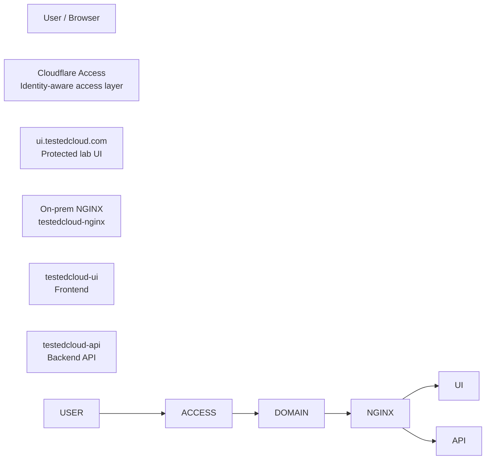
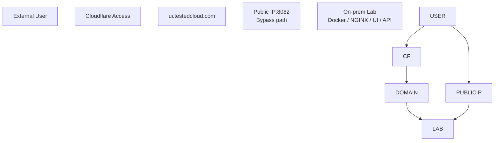
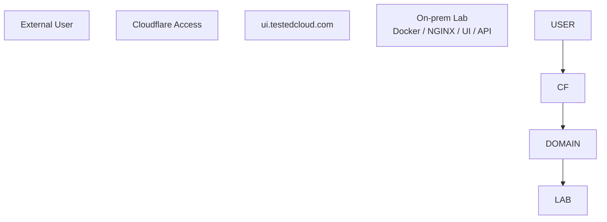

# TestedCloud Cloudflare Access

## 1\. Purpose

This document describes how Cloudflare Access is used to protect the external entry point of the TestedCloud on-prem lab.

The purpose is to document the access model for:

```text
https://ui.testedcloud.com
```

Cloudflare Access is used to provide an identity-aware access layer in front of the lab UI, preventing direct unauthenticated access to the on-prem service.

This document also captures an important troubleshooting event where direct public port forwarding initially bypassed Cloudflare Access and was later removed.

## 2\. Architecture Context

TestedCloud includes an on-prem Docker-based application stack running on an Intel NUC.

On-prem services:

|Service|Purpose|
|-|-|
|`testedcloud-ui`|Frontend application|
|`testedcloud-api`|Backend/API layer|
|`testedcloud-nginx`|Reverse proxy for the local stack|

Local access:

```text
http://localhost:8082
```

Protected external access:

```text
https://ui.testedcloud.com
```

Target access model:

```text
External user
    |
    v
Cloudflare Access
    |
    v
ui.testedcloud.com
    |
    v
On-prem reverse proxy / Docker stack
```

## 3\. Access Model

The intended external access model is:

```text
User / Browser
    |
    v
Cloudflare Access authentication
    |
    v
ui.testedcloud.com
    |
    v
On-prem NGINX
    |
    v
testedcloud-ui / testedcloud-api
```

Cloudflare Access provides an authentication layer before traffic reaches the protected application.

This means that users must authenticate before accessing the lab UI.

## 4\. Access Model Diagram



## 5\. DNS and Domain Separation

The TestedCloud domain model separates public portfolio content from protected operational lab access.

|Domain|Purpose|Access Model|
|-|-|-|
|`testedcloud.com`|Public portfolio landing page|Public|
|`ui.testedcloud.com`|Protected lab UI|Cloudflare Access|
|`api.testedcloud.com`|Optional future API endpoint|Protected / restricted|

Design principle:

```text
testedcloud.com = public story
ui.testedcloud.com = protected working lab
api.testedcloud.com = optional future API surface
```

The public portfolio should not expose the operational lab directly.

## 6\. Security Issue Discovered

### Problem

During the lab build, the protected domain `ui.testedcloud.com` was configured with Cloudflare Access.

However, the on-prem lab was also reachable through direct public IP exposure because a router port forwarding rule exposed the local lab port:

```text
8082
```

This created two access paths:

```text
Protected path:
User -> Cloudflare Access -> ui.testedcloud.com -> On-prem lab

Unprotected path:
User -> Public IP:8082 -> On-prem lab
```

### Impact

The direct public IP path bypassed Cloudflare Access.

This meant the lab was not fully protected even though the domain-based access path was protected.

Security impact:

* Unauthenticated users could potentially reach the lab through the public IP and forwarded port.
* Cloudflare Access protected only the domain path, not the direct router port forwarding path.
* The access model was inconsistent.
* The intended identity-aware access control was bypassable.

### Root Cause

Cloudflare Access protected the DNS/domain-based path, but the home router still exposed the backend service directly through port forwarding.

Cloudflare Access cannot protect a separate direct public IP path if traffic does not pass through Cloudflare.

## 7\. Resolution

The public router port forwarding rule to port `8082` was removed.

After removing the rule, the only intended external access path became:

```text
User
    |
    v
Cloudflare Access
    |
    v
ui.testedcloud.com
    |
    v
On-prem lab
```

Direct public IP access was no longer available.

## 8\. Before and After

### Before



Issue:

```text
The Public IP:8082 path bypassed Cloudflare Access.
```

### After



Improvement:

```text
External access now goes through Cloudflare Access.
```

## 9\. Validation Performed

Validation performed after removing public port forwarding:

|Validation|Expected Result|Status|
|-|-|-|
|Access `https://ui.testedcloud.com`|Cloudflare Access challenge/session required|Validated|
|Authenticate through Cloudflare Access|Lab UI becomes reachable|Validated|
|Access direct public IP with port `8082`|Should not work|Validated|
|Use lab UI after authentication|UI remains functional|Validated|
|Publish event from UI|Pipeline still works|Validated|

## 10\. Cloudflare Access Session Behavior

A separate troubleshooting event occurred where the UI appeared to have a browser/CORS-like issue.

The root cause was not a backend CORS change. The Cloudflare Access session had expired.

After re-authenticating through Cloudflare Access, the UI worked again.

Lesson:

```text
Access-layer session issues can look like application-layer issues.
```

When troubleshooting UI/API communication behind Cloudflare Access, check:

* Access session validity
* Browser authentication state
* Cloudflare Access policy
* Cloudflare Access cookies/session
* NGINX reverse proxy behavior
* Backend availability
* CORS configuration

## 11\. Current Security Controls

Current controls related to external access:

|Control|Description|
|-|-|
|Cloudflare Access|Protects `ui.testedcloud.com`|
|No direct public port forwarding|Removes bypass path to local port `8082`|
|DNS separation|Public portfolio and protected lab are separated|
|NGINX reverse proxy|Routes local UI/API traffic|
|Protected UI path|External users must go through the protected domain|
|Future API separation|`api.testedcloud.com` reserved for future controlled API exposure|

## 12\. Known Limitations

Current known limitations:

* API key handling in the frontend still needs improvement.
* `/api/health` endpoint does not exist yet.
* Cloudflare Access protects access, but backend authorization patterns should still be improved.
* The root public portfolio page is not complete yet.
* A future `api.testedcloud.com` endpoint should not be exposed until the API security model is clearly defined.
* Evidence screenshots or sanitized Cloudflare configuration output should be added later.

## 13\. Recommended Future Improvements

Recommended improvements:

1. Keep `ui.testedcloud.com` protected by Cloudflare Access.
2. Avoid reintroducing direct public port forwarding to the lab.
3. Add `/api/health` for operational validation.
4. Move sensitive API validation out of frontend-exposed code.
5. Consider using Cloudflare Access identity headers for user-aware backend logic.
6. Add rate limiting or additional controls if public API endpoints are introduced.
7. Keep `testedcloud.com` as a public portfolio landing page.
8. Keep operational lab access separate from public portfolio content.
9. Document Cloudflare Access policy settings with sanitized evidence.
10. Add monitoring for failed access attempts if available.

## 14\. Suggested Evidence to Capture

Recommended evidence files:

```text
docs/evidence/cloudflare-access-validation.txt
docs/evidence/public-port-forwarding-removed.txt
docs/evidence/cloudflare-access-policy-summary.txt
```

Suggested sanitized evidence content:

```text
Protected application: ui.testedcloud.com
Access method: Cloudflare Access
Direct public port forwarding to 8082: Removed
Direct public IP access: Not available
Protected UI validation: Successful
```

Do not commit sensitive Cloudflare tokens, account IDs, tunnel secrets, or private IP/public IP details you do not want public.

## 15\. Suggested Manual Evidence File

Example:

```bash
cat > docs/evidence/cloudflare-access-validation.txt <<'EOF'
Protected application: ui.testedcloud.com
Access layer: Cloudflare Access
Direct public port forwarding to local port 8082: Removed
Direct public IP access: Not available
Access through protected domain: Successful
Authentication required: Yes
Status: Validated
EOF
```

Then review:

```bash
cat docs/evidence/cloudflare-access-validation.txt
```

Commit only after confirming no sensitive values are included.

## 16\. Access Troubleshooting Checklist

When troubleshooting access to `ui.testedcloud.com`, check:

```text
\[ ] Is Cloudflare Access session still valid?
\[ ] Can the user authenticate through Cloudflare Access?
\[ ] Does the protected domain resolve correctly?
\[ ] Is the Cloudflare tunnel/proxy path healthy?
\[ ] Is local NGINX running?
\[ ] Are Docker containers running?
\[ ] Is the UI reachable locally?
\[ ] Is the API reachable locally?
\[ ] Was public port forwarding accidentally re-enabled?
\[ ] Are browser errors related to access/session rather than CORS?
```

Useful local checks:

```bash
docker compose ps
curl http://localhost:8082/
```

Possible future check after `/api/health` is implemented:

```bash
curl http://localhost:8082/api/health
```

## 17\. Portfolio Explanation

A concise way to explain this in an interview:

> I used Cloudflare Access to protect the external UI of my on-prem lab at `ui.testedcloud.com`. During testing, I discovered that router port forwarding still exposed the local lab port directly through the public IP, which bypassed the Cloudflare Access path. I removed the public port forwarding rule and validated that the lab was only reachable through the protected domain. This gave me a cleaner identity-aware access model for the hybrid lab.

A more technical version:

> The important lesson was that protecting a DNS path with Cloudflare Access does not protect other network paths to the same backend. Since the router still forwarded port `8082`, direct public IP access could bypass the Access policy. I removed that exposure, kept `ui.testedcloud.com` protected by Cloudflare Access, and documented the domain separation between the public portfolio root and the protected lab UI.

## 18\. Customer Engineer Relevance

This work is relevant to Customer Engineer and Cloud Architect roles because it demonstrates the ability to:

* Identify a security bypass path
* Explain identity-aware access patterns
* Separate public and protected application surfaces
* Troubleshoot browser/access issues across layers
* Understand that DNS security and network exposure must be aligned
* Translate a technical fix into a customer-facing architecture explanation
* Improve the security posture of a hybrid environment

## 19\. Final Positioning

The Cloudflare Access configuration strengthens TestedCloud by providing a protected external entry point for the on-prem lab UI.

The troubleshooting and remediation of the public port forwarding bypass demonstrates practical security awareness, layered troubleshooting, and production-style thinking for hybrid cloud access patterns.

