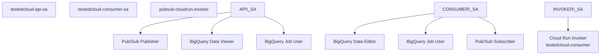

# TestedCloud IAM Hardening

## 1\. Purpose

This document describes the IAM hardening work completed in the TestedCloud Core Platform.

The goal was to improve the security posture of the lab by reducing dependency on broad default identities, introducing dedicated service accounts, separating workload responsibilities, and validating that the event pipeline continued working after permission changes.

This document is part of the TestedCloud portfolio documentation and is intended to demonstrate production-style thinking around identity, least privilege, service-to-service authentication, and operational validation.

## 2\. Why IAM Hardening Was Needed

During the initial build, some workloads depended on the default Compute Engine service account.

Default service accounts are useful for quick experiments, but in production-style environments they can create risk if they accumulate broad permissions over time.

The main concern was that a single broad service account could be used by multiple workloads, making it harder to understand which workload needed which permissions.

The goal was to move toward a least-privilege model where every workload has a clear identity and only the permissions it needs.

## 3\. Original Risk

The default Compute Engine service account was present in the environment:

```text
644725546932-compute@developer.gserviceaccount.com
```

Identified risks:

* Cloud Run was initially using the default Compute Engine service account.
* The default Compute Engine service account had broad project-level permissions.
* The default Compute Engine service account had BigQuery write capability.
* The permission model did not clearly separate API publishing, Cloud Run processing, and Pub/Sub invocation.
* Troubleshooting future access issues would be harder because multiple workloads could depend on the same broad identity.
* The blast radius would be larger if a workload using the default service account were compromised.
* The design did not fully reflect a production-style least-privilege architecture.

## 4\. Target IAM Model

The target design separates responsibilities across dedicated service accounts.

|Service Account|Purpose|
|-|-|
|`testedcloud-api-sa@majestic-layout-255620.iam.gserviceaccount.com`|On-prem/API publishing identity|
|`testedcloud-consumer-sa@majestic-layout-255620.iam.gserviceaccount.com`|Cloud Run runtime identity|
|`pubsub-cloudrun-invoker@majestic-layout-255620.iam.gserviceaccount.com`|Pub/Sub OIDC identity to invoke Cloud Run|

This model creates clearer separation of duties:

```text
On-prem/API publishing
    |
    v
testedcloud-api-sa

Cloud Run event processing
    |
    v
testedcloud-consumer-sa

Pub/Sub push invocation
    |
    v
pubsub-cloudrun-invoker
```

## 5\. Service Account Responsibilities

### 5.1 testedcloud-api-sa

Service account:

```text
testedcloud-api-sa@majestic-layout-255620.iam.gserviceaccount.com
```

Purpose:

* Used by the API/on-prem side of the platform.
* Publishes events into Pub/Sub.
* Can read BigQuery views or metadata if needed.
* Can run BigQuery jobs if needed.

Roles:

|Role|Purpose|
|-|-|
|Pub/Sub Publisher|Allows publishing events to the Pub/Sub topic|
|BigQuery Data Viewer|Allows reading relevant BigQuery datasets/views if required|
|BigQuery Job User|Allows running BigQuery jobs if required|

Design intent:

* This identity should represent the producer/publisher side of the platform.
* It should not be the runtime identity for Cloud Run.
* It should not have unnecessary administrative permissions.

### 5.2 testedcloud-consumer-sa

Service account:

```text
testedcloud-consumer-sa@majestic-layout-255620.iam.gserviceaccount.com
```

Purpose:

* Used as the runtime identity for Cloud Run.
* Receives and processes Pub/Sub push messages.
* Writes processed events to BigQuery.

Roles:

|Role|Purpose|
|-|-|
|BigQuery Data Editor|Allows the Cloud Run consumer to insert processed events into BigQuery|
|BigQuery Job User|Allows the consumer to run BigQuery jobs if required|
|Pub/Sub Subscriber|Allows subscriber-related access for the event processing path|

Design intent:

* This identity should represent the event processing workload.
* It should have enough permissions to process and write events.
* It should not have broad project-level administrative permissions.

### 5.3 pubsub-cloudrun-invoker

Service account:

```text
pubsub-cloudrun-invoker@majestic-layout-255620.iam.gserviceaccount.com
```

Purpose:

* Used by Pub/Sub push subscription.
* Provides OIDC authentication when invoking the Cloud Run consumer.

Role:

|Role|Scope|
|-|-|
|Cloud Run Invoker|Granted on `testedcloud-consumer`|

Design intent:

* This identity should only be responsible for invoking Cloud Run.
* It should not be used as a general runtime identity.
* It supports authenticated Pub/Sub push delivery to Cloud Run.

## 6\. Hardening Actions Completed

The following actions were completed:

1. Created or confirmed dedicated service accounts.
2. Migrated Cloud Run `testedcloud-consumer` from the default Compute Engine service account to `testedcloud-consumer-sa`.
3. Deleted the legacy Cloud Run service `project1`.
4. Removed `roles/editor` from the default Compute Engine service account.
5. Removed `roles/bigquery.dataEditor` from the default Compute Engine service account.
6. Verified that no IAM bindings remained for the default Compute Engine service account.
7. Validated that the event pipeline continued working after the IAM changes.

## 7\. Before and After

### 7.1 Before

```text
Cloud Run testedcloud-consumer
    |
    v
Default Compute Engine Service Account
    |
    v
Broad project-level permissions
```

Problems:

* Broad identity
* Higher blast radius
* Less clear ownership
* Harder troubleshooting
* Less production-like IAM design
* Weak separation between runtime, publisher, and invoker responsibilities

### 7.2 After

```text
Cloud Run testedcloud-consumer
    |
    v
testedcloud-consumer-sa
    |
    v
Focused BigQuery and Pub/Sub permissions
```

Benefits:

* Reduced blast radius
* Cleaner service identity model
* Better least-privilege alignment
* Easier troubleshooting
* Better auditability
* Stronger portfolio and interview narrative

## 8\. IAM Responsibility Diagram



## 9\. Pub/Sub to Cloud Run Authentication

The Pub/Sub push subscription invokes Cloud Run using OIDC authentication.

Flow:

```text
Pub/Sub Push Subscription
    |
    v
OIDC token using pubsub-cloudrun-invoker
    |
    v
Cloud Run testedcloud-consumer
```

This avoids relying on unauthenticated public invocation and aligns better with production service-to-service authentication patterns.

The identity used for invoking Cloud Run is different from the identity used by Cloud Run at runtime.

This separation is important:

|Identity|Used For|
|-|-|
|`pubsub-cloudrun-invoker`|Invoking Cloud Run|
|`testedcloud-consumer-sa`|Running the Cloud Run container and writing to BigQuery|

## 10\. Cloud Run Runtime Identity

Cloud Run now uses:

```text
testedcloud-consumer-sa@majestic-layout-255620.iam.gserviceaccount.com
```

This means that when the Cloud Run service processes a request and writes data into BigQuery, it does so using the dedicated consumer identity.

This is better than using the default Compute Engine service account because:

* Permissions are easier to reason about.
* The service identity maps directly to the workload function.
* Future permission changes can be made without affecting unrelated workloads.
* Audit logs become easier to interpret.
* The design more closely resembles production architecture.

## 11\. Default Compute Engine Service Account Cleanup

The default Compute Engine service account was cleaned up.

Default Compute Engine service account:

```text
644725546932-compute@developer.gserviceaccount.com
```

Removed permissions:

* `roles/editor`
* `roles/bigquery.dataEditor`

Validation performed:

* Checked IAM bindings.
* Confirmed no remaining IAM bindings for the default Compute Engine service account.
* Confirmed the pipeline still worked after the permissions were removed.

This was a critical validation step because it proved that the active pipeline no longer depended on broad default credentials.

## 12\. Validation Performed

After IAM hardening, the pipeline was tested again.

Validated flows:

|Test|Result|
|-|-|
|Event from web UI to Pub/Sub|Successful|
|Pub/Sub push to Cloud Run|Successful|
|Cloud Run processing|Successful|
|BigQuery insert|Successful|
|Cloud Run logs showing successful processing|Successful|
|Pipeline functioning without default Compute Engine service account bindings|Successful|

Important validation result:

```text
Pipeline still worked after hardening.
```

This confirms that the dedicated service accounts had the required permissions and that the default Compute Engine service account was no longer needed for the active pipeline.

## 13\. Security Value

The IAM hardening work improved the platform in several ways:

* Removed unnecessary broad project-level access.
* Reduced dependency on default service accounts.
* Created clearer separation of duties.
* Improved least-privilege alignment.
* Improved auditability.
* Reduced the impact of a potential workload compromise.
* Made the architecture easier to explain in a production-readiness review.
* Made the lab more credible as a portfolio artifact.
* Improved alignment with cloud security best practices.

## 14\. Operational Value

This work is also useful from an operations perspective.

Benefits:

* Easier troubleshooting when a permission issue occurs.
* Easier identification of which workload is failing.
* Cleaner access review.
* Better audit log interpretation.
* Easier future expansion as new modules are added.
* Safer foundation for adding TestedChat, SINEC NMS telemetry, industrial telemetry, and Vertex AI experiments.

## 15\. Remaining Improvements

Future IAM and security improvements:

* Move frontend API key handling to a safer model.
* Use Secret Manager for sensitive runtime configuration.
* Review whether BigQuery Data Editor can be narrowed at the dataset or table level.
* Add IAM Conditions where useful.
* Add Cloud Audit Logs review as part of the documentation.
* Create a permission matrix for every workload.
* Document exact `gcloud` commands used for IAM changes.
* Add screenshots or command output evidence under `docs/evidence`.
* Consider using separate environments for dev, test, and demo.
* Review whether the API service account needs all current permissions.
* Review whether service account key usage can be eliminated or reduced.
* Prefer workload identity or token-based patterns where practical.

## 16\. Suggested Evidence to Capture

To make this document stronger for portfolio purposes, capture evidence in `docs/evidence`.

Recommended evidence:

|Evidence|Purpose|
|-|-|
|IAM policy output after cleanup|Proves broad default service account permissions were removed|
|Cloud Run service identity screenshot/output|Proves Cloud Run uses `testedcloud-consumer-sa`|
|Pub/Sub subscription push config|Proves OIDC invoker identity is configured|
|Cloud Run logs after hardening|Proves processing still works|
|BigQuery rows after hardening|Proves data still lands in BigQuery|
|Command output showing no default compute SA bindings|Proves cleanup was successful|

Suggested evidence file names:

```text
docs/evidence/iam-policy-after-hardening.txt
docs/evidence/cloud-run-service-identity.txt
docs/evidence/pubsub-push-oidc-config.txt
docs/evidence/pipeline-validation-after-iam-hardening.txt
```

## 17\. Suggested Validation Commands

The following commands can be used to collect validation evidence.

### Check Cloud Run service account

```bash
gcloud run services describe testedcloud-consumer \\
  --region=us-central1 \\
  --format="value(spec.template.spec.serviceAccountName)"
```

Expected value:

```text
testedcloud-consumer-sa@majestic-layout-255620.iam.gserviceaccount.com
```

### Check Pub/Sub push subscription configuration

```bash
gcloud pubsub subscriptions describe testedcloud-consumer-sub
```

Expected items to verify:

* `pushConfig`
* `oidcToken`
* `serviceAccountEmail`
* `pubsub-cloudrun-invoker@majestic-layout-255620.iam.gserviceaccount.com`
* Cloud Run push endpoint

### Check IAM bindings for default Compute Engine service account

```bash
gcloud projects get-iam-policy majestic-layout-255620 \\
  --flatten="bindings\[].members" \\
  --filter="bindings.members:644725546932-compute@developer.gserviceaccount.com" \\
  --format="table(bindings.role)"
```

Expected result:

```text
Listed 0 items.
```

### Check recent Cloud Run logs

```bash
gcloud logging read \\
  'resource.type="cloud\_run\_revision" AND resource.labels.service\_name="testedcloud-consumer"' \\
  --limit=20 \\
  --format="table(timestamp,severity,textPayload)"
```

Expected result:

* Recent successful processing logs
* `POST 204`
* `PIPELINE\_EVENT\_PROCESSED`

## 18\. Interview Explanation

A concise way to explain this work in an interview:

> I initially had parts of the lab using the default Compute Engine service account, which is common in early prototypes but not ideal for production-style architecture. I hardened the IAM model by migrating Cloud Run to a dedicated runtime service account, using a separate Pub/Sub invoker service account for OIDC authentication, and removing broad Editor and BigQuery permissions from the default compute service account. After the change, I validated that the pipeline still worked end-to-end, proving that the platform no longer depended on broad default credentials.

A slightly more technical version:

> I separated the service identities by responsibility. The API publishing side uses `testedcloud-api-sa`, Cloud Run runs as `testedcloud-consumer-sa`, and Pub/Sub invokes Cloud Run through a dedicated OIDC invoker service account. Then I removed broad roles from the default Compute Engine service account and validated that Pub/Sub, Cloud Run, and BigQuery continued working. That gave me a cleaner least-privilege model and reduced the blast radius of the platform.

## 19\. Customer Engineer Relevance

This work is relevant to Customer Engineer and Cloud Architect roles because it demonstrates the ability to:

* Identify security risks in an early architecture.
* Move from prototype-style access to production-style access.
* Explain IAM trade-offs clearly.
* Separate service identities by function.
* Validate changes without breaking the application.
* Communicate security improvements in business and technical terms.
* Connect security design to operational reliability.

## 20\. Final Positioning

This IAM hardening work demonstrates that TestedCloud is not only a functional lab, but a production-style architecture exercise focused on least privilege, service identity, validation, and operational security.

It shows the ability to design, improve, and explain cloud security controls in a practical hybrid cloud environment.

